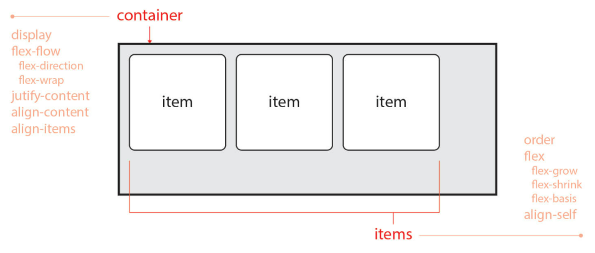
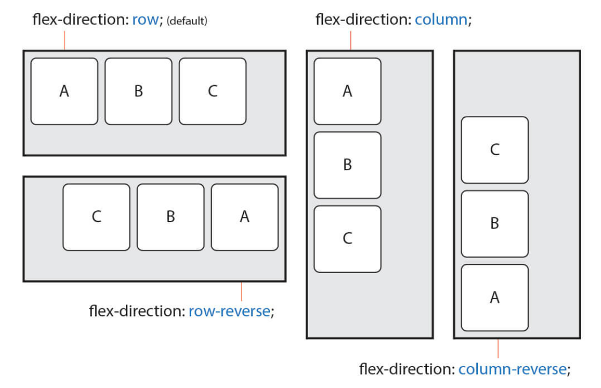
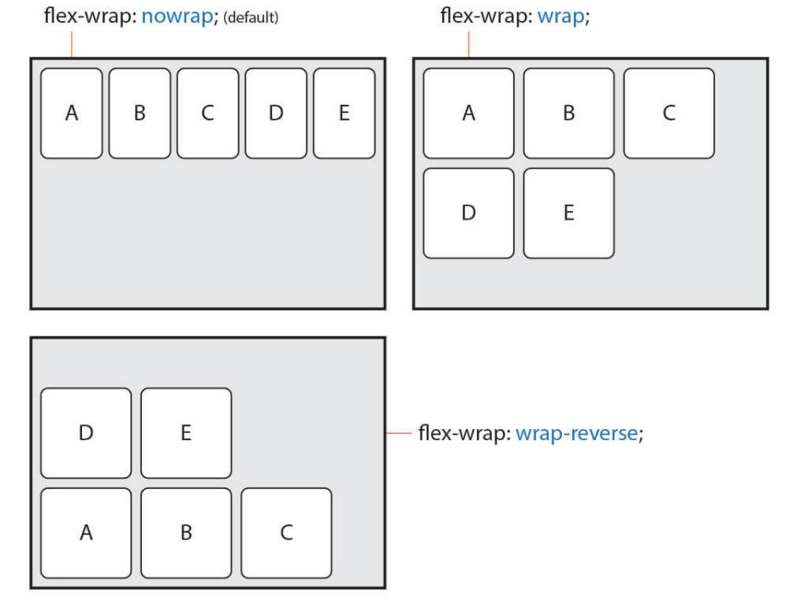
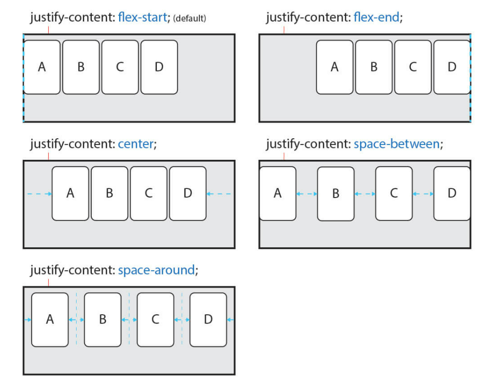
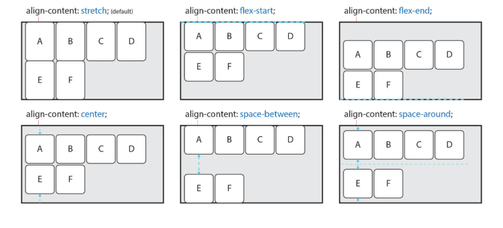
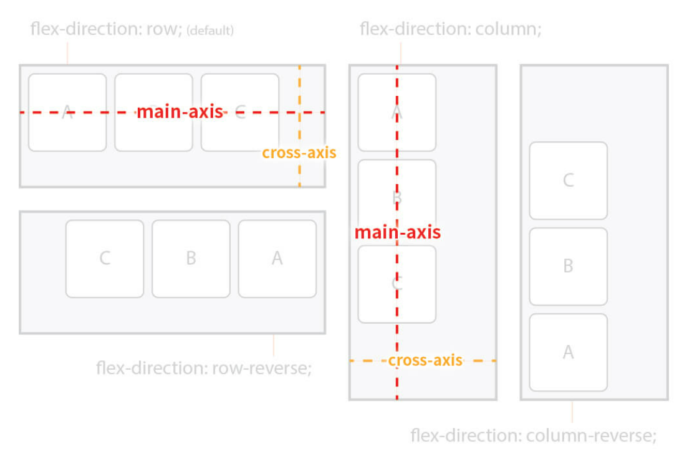
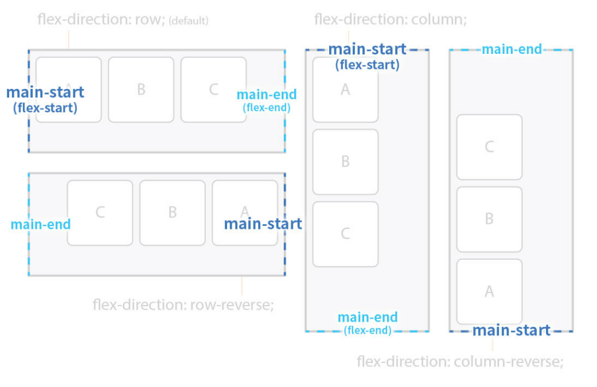
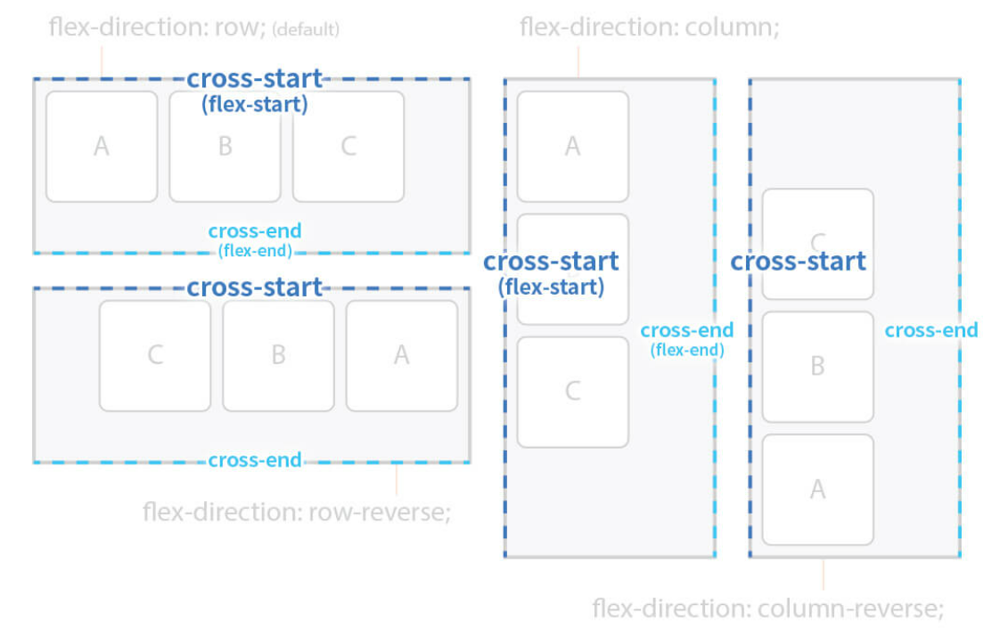

# CSS
만들어진 구조에 원하는 레이아웃을 적용하는 것

# 

## 기본 형태
```css
선택자 {
    속성 : 값;
    속성 : 값;
    ...
}
```

### 선택자(Selector)
- 작성한 HTML에 CSS 스타일을 적용하기 위해 HTML의 특정 요소를 선택하는 Sign (어디에 적용할지 선택, 특정 태그, id, class)
```css
TAG {
    Properties : Value
}

.Class{
    Properties : Value
}
```

### 속성(Properties), 값(Value)
- 선택자에 적용 가능한 스타일(속성)을 특정 값으로 지정
- HTML의 속성은 Attribute, CSS의 속성은 Properties
- 속성에 따라 여러 값이 들어갈 수 있음
    - 단축속성 & 개별속성
        - ex
            - margin : 단축속성
            - margin-top, margin-left, margin-right, margin-bottom : 개별속성

[CSS mdn](https://developer.mozilla.org/ko/docs/Web/CSS "CSS mdn")

# 

# 선언 방식

### 태그에 직접 작성(인라인)하는 선언방식

\<<span style="color:blue">TAG</span> <span style="color:skyblue">style=</span><span style="color:orange">"속성: 값;"</span>>contents\<<span style="color:blue">/TAG</span>>
- 선택자 필요 없이 직접 선언 가능
- 반복된 요소에 적용할 때 인라인 선언 방식을 지양해야한다.
- JavaScript로 HTML에 CSS를 강제로 삽입할 때는 상관X

### HTML에 내장하여 표현
```html
<head>
    <style>
        TAG {
            Properties : Value;
        }
    </style>
</head>
```

- style태그를 통해 CSS코드가 HTML안에 포함되어있는 상황

### HTML 외부에서 불러오기(link)
```html
<head>
    <link rel="stylesheet" href="경로">
</head>
```
- 외부 .css 파일을 link태그로 절대/상대 경로를 통해 불러와 적용시키는 것

### @import 방식
@import를 이용하여 외부로부터 문서를 불러오는 방식
- css가 css를 가져오는 방식
- link로 여러 css를 불러오는 경우 병렬 호출로 불러오지만 @import로 불러오는 css는 직렬 호출로 불러오므로 시간이 더 걸릴 수 있다.
- 특정 css가 모두 호출 된 후 사용되어야하는 특별한 경우 @import로 호출 해야할 것.
```html
<!-- index.html -->
<head>
    <link rel="stylesheet" href = "./css/style1.css">
</head>
<body>
    <div>sample</div>
</body>
```
```css
/* style1.css */
@import url("./style2.css")
```
```css 
/* style2.css */
div {
    color: red;
    background-color: blue;
}
```

CSS 작성 시 HTML 구조의 순서와 동일하게 작성하는 것이 유지보수에 유리

#

# 선택자

## 기본 선택자(Basic Selectors)
- 전체 선택자(Universal Selector)
    - 요소 내부의 모든 요소를 선택
    - [Universal Selector mdn](https://developer.mozilla.org/ko/docs/Web/CSS/Universal_selectors "Universal Selector mdn")
```css
    * { };
```

- 태그 선택자(Type Selector)
    - 특정 태그 이름인 요소를 선택
    - [Type Selector mdn](https://developer.mozilla.org/ko/docs/Web/CSS/Type_selectors "Type Selector mdn")
```css
    Tag {};
```

- 클래스 선택자(Class Selector)
    - HTML class 속성의 값을 요소로 선택
    - [Class Selctor mdn](https://developer.mozilla.org/ko/docs/Web/CSS/Class_selectors "Class Selector mdn")
```css
    .class {};
```

- 아이디 선택자(ID Selector)
    - HTML id 속성의 값을 요소로 선택
    - HTML에서 id는 고유해야함.
    - [ID Selector mdn](https://developer.mozilla.org/ko/docs/Web/CSS/ID_selectors "ID Selector mdn")
```css
    #id {};
```

## 복합 선택자(Combinators)
기본 선택자들을 조합해서 사용
- 일치 선택자(Basic Combinator)
    - 붙여서 표현한 기본 선택자들의 조건이 모두 만족하는 경우 스타일 적용
```css
    tag.class#id {};
```
- 자식 선택자(Child Combinator)
    - 기본 선택자 Parent의 자식 기본 선택자 Child를 선택
    - 한 depth 차이인 경우 부모/자식 관계
    - [Child Combinator mdn](https://developer.mozilla.org/ko/docs/Web/CSS/Child_combinator "Child Combinator mdn")
```css
    Parent > Child {};      /* 조건 > 조건 > .. > 선택*/
```
- 후손(하위) 선택자(Descendant Combinator)
    - 기본 선택자 조상(상위) 요소의 후손(하위) 요소인 기본 선택자를 선택
    - depth 차이가 나도 조상(상위) 요소 내부에 포함되어 있다면 모두 후손(하위) 요소로 판단 가능
    - 띄어쓰기로 선택자 구분
    - [Descendant Combinator mdn](https://developer.mozilla.org/ko/docs/Web/CSS/Descendant_combinator "Descendant Combinator mdn")
```css
    Parent Child {};
```
- 인접 형제 선택자(Adjacent Sibling Combinator)
    - 같은 부모 요소를 공유하는 다른 요소(형제) 선택
    - 특정 요소의 바로 다음 지정 형제 요소 하나만을 선택
    - [Adjacent Sibling Combinator mdn](https://developer.mozilla.org/ko/docs/Web/CSS/Adjacent_sibling_combinator "Adjacent Sibling Combinator mdn")
```css
    A + B {};
```
```html
<P>
    <A></A>
    <B></B>     <!-- A의 다음 형제요소 B 하나만을 선택 -->
    <B></B>
</P>
```

- 일반 형제 선택자(General Sibling Combinator)
    - 같은 부모 요소를 공유하는 다른 요소(형제) 선택
    - 특정 요소의 인접한 다음 형제 요소 모두 선택
    - [General Sibling Combinator](https://developer.mozilla.org/ko/docs/Web/CSS/General_sibling_combinator "General Sibling Combinator mdn")
```css
    A ~ B {};
```
```html
<P>
    <B></B>     <!-- 이전 형제 요소는 선택X-->
    <A></A>
    <B></B>     <!-- 다음 B 모두 선택-->
    <B></B>     <!-- 다음 B 모두 선택-->
</P>
```

## 가상 클래스 선택자(Pseudo-Classes Selectors)
기본 선택자를 활용(:)

### :hover
기본 선택자에 마우스 포인터가 올라가 있는 동안에만 선택
- [:hover mdn](https://developer.mozilla.org/ko/docs/Web/CSS/:hover ":hover mdn")
```css
    E:hover {};
```

### :active
기본 선택자를 마우스로 클릭하고 있는 동안에만 선택
- [:active mdn](https://developer.mozilla.org/ko/docs/Web/CSS/:active ":active mdn")
```css
    E:active {};
```

### :focus
[대화형 콘텐츠](https://developer.mozilla.org/ko/docs/Web/Guide/HTML/Content_categories#%EB%8C%80%ED%99%94%ED%98%95_%EC%BD%98%ED%85%90%EC%B8%A0 "대화형 콘텐츠") 선택자가 포커스 된 동안에만 선택
- [:focus mdn](https://developer.mozilla.org/ko/docs/Web/CSS/:focus ":focus mdn")
```css
    E:focus {};
```

### :first-child
해당 기본 선택자의 형제 요소들 중 첫 번째 요소만 선택
- [:first-child mdn](https://developer.mozilla.org/ko/docs/Web/CSS/:first-child ":first-child mdn")
```css
    E:first-child {};
```

### :last-child
해당 기본 선택자의 형제 요소들 중 마지막 요소만 선택
- [:last-child mdn](https://developer.mozilla.org/en-US/docs/Web/CSS/:last-child ":last-child mdn")
```css
    E:last-child {};
```

### :nth-child
해당 기본 선택자의 형제 요소들 중 n 번째 요소만 선택
- n에 해당하는 값이 (xn)일 때 x의 배수마다 선택
- n에 해당하는 값이 (n + x)일 때 x번째 요소부터 끝까지 선택
- [:nth-child mdn](https://developer.mozilla.org/ko/docs/Web/CSS/:nth-child ":nth-child mdn")
```css
    E:nth-child(n) {};
```

### :nth-of-type(n)
해당 기본 선택자의 타입(태그의 이름)과 동일한 타입인 형제 요소 중 해당 기본 선택자가 n번째 요소라면 선택
- 특정 선택자의 타입 중 n번째 선택
- 태그를 찾는 개념으로서만 사용할 것
- [:nth-of-type() mdn](https://developer.mozilla.org/en-US/docs/Web/CSS/:nth-of-type ":nth-of-type() mdn")
```css
    E:nth-of-type(n) {};
```

### 부정 선택자(Negation Selector)
S가 아닌 요소 선택
- :not()
- [:not() mdn](https://developer.mozilla.org/ko/docs/Web/CSS/:not ":not() mdn")
```css
    E:not(S) {};
```
#### 가상클래스의 경우 역순으로 해석하는 것이 보다 정확함.
#### 콜론(:)앞에 특정 요소를 작성하지 않을 경우 특정 요소가 아닌 가능한 경우들이 모두 선택될 수 있다.

#

# 가상 요소 선택자(Pseudo-Elements Selectors)
콜론 두개(::)로 표현
- content 속성을 사용해야 가상 요소 선택자를 사용할 수 있다.

### ::before
특정 요소 내부에서 내용의 앞에 내용(content)을 삽입
- [::before mdn](https://developer.mozilla.org/ko/docs/Web/CSS/::before "::before mdn")
```css
    E::before {};
```

### ::after
특정 요소 내부에서 내용의 뒤에 내용(content)을 삽입
- [::after mdn](https://developer.mozilla.org/ko/docs/Web/CSS/::after "::after mdn")
```css
    E:after {};
```

#

# 속성 선택자(Attribute Selectors)
HTML의 속성을 포함한 요소 선택
- \[attribute]
    - 특정 속성을 포함한 요소 모두 선택
```css
    [attribute] {};
```

- \[attribute=value]
    - 특정 속성을 포함하여 값이 value인 요소 선택
```css
    [attribute=value] {};
```

- \[attribute^=value]
    - 특정 속성을 포함하여 값이 value로 시작하는 요소 선택
```css
    [attribute^=value] {};
```

- \[attribute$=value]
    - 특정 속성을 포함하여 값이 value로 끝나는 요소 선택
```css
    [attribute$=value] {};
```

- [Attribute Selectors mdn](https://developer.mozilla.org/ko/docs/Web/CSS/Attribute_selectors "Attribute Selectors mdn")


#

# 상속(Inheritance)
CSS의 일부 속성은 상속되는 속성(Inherited properties)으로 하위 요소에도 모두 적용되는 경우가 존재
- 대부분 글자를 다루는 속성들이 상속됨.
- 원래는 상속되지 않는 속성들을 강제적으로 상속시킬 수 있음
    - 부모 요소의 속성의 값이 무엇이 되던지 간에 해당 값을 강제로 상속 받아 사용할 수 있다.
```html
<div class="parent">
    <div class="child"></div>
</div>
```
```css
.parent {
    position: absolute;     /* 상속되지 않는 속성과 값 */
}
.child {
    position: inherit;      /* 강제 상속 받아 position: absolute; 와 동일*/
}
```
- [Inheritance mdn](https://developer.mozilla.org/ko/docs/Web/CSS/inheritance "Inheritance mdn")

#

# 우선 순위
같은 요소가 여러 선언의 대상이 될 경우 어떤 선언의 css 속성을 우선 적용할지 결정하는 방법
1. [명시도](https://developer.mozilla.org/ko/docs/Web/CSS/Specificity "명시도 mdn") : 명시도 점수가 높은 선언이 우선
2. 선언 순서 : 점수가 같은 경우, 가장 마지막에 해석(늦게 작성 된)되는 선언이 우선
3. 중요도 : 명시도는 '상속' 규칙보다 우선, !important가 적용된 선언 방식이 다른 모든 방식보다 우선
```html
<body>
    <div id="color_yellow" class="color-green" style="color: orange;">Hello world!</div>
                                    <!-- 인라인 선언방식 -->
</body>
```
```css
div { color: red !important; }      /* !important */
#color_yellow { color: yellow; }    /* 아이디 선택자 */
.color-green { color: green;}       /* 클래스 선택자 */
div { color: blue; }                /* 태그 선택자 */
* { color: darkblue; }              /* 전체 선택자 */
body { color: violet; }             /* 상속 */
```
## 명시도 점수
1. !important           (∞ pt)
2. 인라인 선언 방식     (1000 pt)
3. 아이디 선택자        (100 pt)
4. 클래스 선택자        (10 pt)
5. 태그 선택자          (1 pt)
6. 전체 선택자          (0 pt)
7. 상속                 (계산하지 않음)

```css
.list li.item { color: red; }  /* 21pt */
.list li:hover { color: red; }  /* 21pt */
.box::before { content: "Good "; color: red; }  /* 11pt */
#submit span { color: red; }  /* 101pt */
header .menu li:nth-child(2) { color: red; }  /* 22pt */
h1 { color: red; }  /* 1pt */
:not(.box) { color: red; }  /* 10pt */
:not(span) { color: red; }  /* 1pt */

/* 가상 요소는 태그 선택자와 같이 1pt (요소 = 태그) */
/* 부정 선택자인 가상 클래스 :not()은 점수를 가지지 않는다. */
```

#

## Reset.css 라이브러리
브라우저마다 초기 설정된 기본값들이 다르기 때문에 CSS 스타일을 reset 후 문서를 작성해야 함.
[reset.css cdn](https://www.jsdelivr.com/package/npm/reset-css "reset.css cdn")

#

## Emmet
Emmet 문법을 사용해 편리한 문서작성 가능
[Emmet cheet-sheet](https://docs.emmet.io/cheat-sheet/ "Emmet cheet-sheet")

#

# CSS 단위

### px
지정한 크기만큼 사이즈 고정

### %
부모 요소에 영향을 받아서 단위가 완성

### em
자기 자신이 가지고 있는 폰트 크기에 영향을 받음
- font-size * em 값으로 지정
- font-size에 em단위를 지정할 경우 기본 값인 10px에 em값을 곱한 크기로 지정

### rem
폰트 관련 속성은 기본적으로 상속되는데 rem단위로 작성하면 가장 높은 조상인 html에 작성된 폰트 사이즈만을 기준으로 크기를 지정
- 폰트 사이즈의 기본 값을 body에 작성해 놓으면 해당 문서의 기본값과 rem에서 사용하는 폰트 사이즈와 구분지어서 사용할 수 있다.

### vw
viewport-width, 보여지는 화면의 가로 너비 기준
- 백분율로 적용
- 반응형으로 작동

### vh
viewport-width, 보여지는 화면의 세로 너비 기준
- 백분율로 적용
- 반응형으로 작동

### vmax
viewport-max, 보여지는 화면에서 가로와 세로를 비교했을 때 현재 더 넓은 사이즈를 기준
- 백분율로 적용
- 반응형으로 작동

### vmin
viewport-min, 보여지는 화면에서 가로와 세로를 비교했을 때 현재 더 짧은 사이즈를 기준
- 백분율로 적용
- 반응형으로 작동

#

# 박스 모델

### width, height
요소의  가로 너비(width), 세로 너비(height)를 지정
- 기본값 : auto
    - auto
        - block 요소
            - width : 100%, height : 0
        - inline 요소
            - width : 0, height : 0
            - inline 요소는 기본적으로 가로 세로 값을 가질 수 없다.
- [width](https://developer.mozilla.org/ko/docs/Web/CSS/width "width mdn") / [height](https://developer.mozilla.org/ko/docs/Web/CSS/height "height mdn")

#

### max-width, min-width, max-heigth, min-height
요소의 최대(max), 최소(min) 가로 너비(width), 세로 너비(height)를 지정
- 부모 요소의 너비를 상속받아 가변하되, 최대, 최소 너비를 지정하는 방식
- max-width, max-height
    - 기본값 : none
    - auto : 브라우저가 너비를 계산
- min-width, min-heigjht
    - 기본값 : 0
    - auto : 브라우저가 너비를 계산
- [max-width](https://developer.mozilla.org/ko/docs/Web/CSS/max-width "max-width mdn") / [min-width](https://developer.mozilla.org/ko/docs/Web/CSS/min-width "min-width mdn") / [max-height](https://developer.mozilla.org/ko/docs/Web/CSS/max-height "max-height mdn") / [min-height](https://developer.mozilla.org/ko/docs/Web/CSS/max-height "min-height mdn") mdn

#

### margin
요소의 '외부(바깥)여백'을 지정
- 음수 값 사용 가능
- margin은 부모 요소의 width를 기준으로 지정 됨.
- 기본값 : 0
- 단축 속성
    - margin : 위 우 아래 좌;
    - margin : 위 [좌, 우] 아래;
    - margin : [위, 아래] [좌, 우];
    - margin : [위, 아래, 좌, 우];
- 개별 속성
    - margin-top, margin-right, margin-left, margin-bottom
- 마진 중복(병합, Collapse)
    - 마진의 특정 값들이 '중복'되어 합쳐지는 현상
        1. 형제 요소들의 margin-top 과 margin-bottom 이 만났을 때
        2. 부모 요소의 margin-top 과 자식 요소의 margin-top 이 만났을 때
            - 자식 요소의 margin-top 이 부모 요소에도 적용 된다.
        3. 부모 요소의 margin-bottom 과 자식 요소의 margin-bottom 이 만났을 때
            - 자식 요소의 margin-bottom 이 부모 요소에도 적용 된다.
    - 마진 중복 현상 발생시 중복 값을 계산하는 방법
        - 둘 다 양수 : 더 큰 값으로 중복
        - 둘 다 음수 : 더 작은 값으로 중복
        - 양수와 음수 : a + b
    - 마진 중복은 오류가 아닌 현상이므로 이를 응용해서 사용하거나 우회해서 해결할 수 있다.
- [margin mdn](https://developer.mozilla.org/ko/docs/Web/CSS/margin "margin mdn")

#

### padding
요소의 '내부(안) 여백'을 지정
- 기본값 : 0
- 단축 속성
    - padding : 위 우 아래 좌;
    - padding : 위 [좌, 우] 아래;
    - padding : [위, 아래] [좌, 우];
    - padding : [위, 아래, 좌, 우];
- 개별 속성
    - padding-top, padding-right, padding-left, padding-bottom
- 크기 증가
    - 추가된 padding 값 만큼 요소의 크기가 커지는 현상
    - padding 값 만큼 크기가 증가하므로 크기가 커지지 않도록 계산해야 한다.
        - 직접 계산
        - box-sizing: border-box; : 자동 계산
- [padding mdn](https://developer.mozilla.org/ko/docs/Web/CSS/padding "padding mdn")

#

### border
요소의 '테두리 선'을 지정
- 단축 속성
    - border : border-width border-style border-color
- 개별 속성
    - border-width : 선의 두께(너비) / 기본값 : medium
        - medium, thin, thick, 단위 지정
    - border-style : 선의 종류 / 기본값 : none
        - none, hidden, solid, dotted, dashed ....
        - [선의 종류](https://developer.mozilla.org/ko/docs/Web/CSS/border-style#%EA%B0%92 "선의 종류")
    - border-style : 선의 색상 / 기본값 : black
    - border의 각각의 개별 속성들은 개별속성이면서 추가적으로 단축 속성들이다.
- 요소의 외부에 선을 추가하는 것이므로 결과적으로 요소의 선만큼 크기가 추가된다고 볼 수 있다.
- [border mdn](https://developer.mozilla.org/ko/docs/Web/CSS/border "border mdn")

### border-width
요소의 '선의 두께'를 지정
- 기본값 : medium
- 단축 속성
    - border-width : 위 우 아래 좌;
    - border-width : 위 [좌, 우] 아래;
    - border-width : [위, 아래] [좌, 우];
    - border-width : [위, 아래, 좌, 우];
- 개별 속성
    - border-top-width, border-right-width, border-left-width, border-bottom-width
- [border-width mdn](https://developer.mozilla.org/ko/docs/Web/CSS/border-width "border-width mdn")

### border-style
요소의 '선의 종류'를 지정
- 기본값 : none
- 단축 속성
    - border-style : 위 우 아래 좌;
    - border-style : 위 [좌, 우] 아래;
    - border-style : [위, 아래] [좌, 우];
    - border-style : [위, 아래, 좌, 우];
- 개별 속성
    - border-top-style, border-right-style, border-left-style, border-bottom-style
- [border-style mdn](https://developer.mozilla.org/ko/docs/Web/CSS/border-style "border-style mdn")
- [선의 종류](https://developer.mozilla.org/ko/docs/Web/CSS/border-style#%EA%B0%92 "선의 종류")

### border-color
요소의 '선의 색상'을 지정
- 기본값 : black
- transparent : 투명한 선, 배경색이 지정되어 있다면 배경색이 보이게 된다.
- 단축 속성
    - border-color : 위 우 아래 좌;
    - border-color : 위 [좌, 우] 아래;
    - border-color : [위, 아래] [좌, 우];
    - border-color : [위, 아래, 좌, 우];
- 개별 속성
    - border-top-color, border-right-color, border-left-color, border-bottom-color
- [border-color](https://developer.mozilla.org/ko/docs/Web/CSS/border-color "border-color mdn")

#

### box-sizing
요소의 크기 계산 기준을 지정
- 기본값 : content-box
    - content-box : 너비(width, height)만으로 요소의 크기를 계산
    - border-box : 너비(width, height)에 안쪽 여백(padding)과 테두리 선(border)을 포함하여 요소의 크기를 계산
- content-box < padding-box < border-box < margin-box
    - 
- [box-sizing mdn](https://developer.mozilla.org/ko/docs/Web/CSS/box-sizing "box-sizing mdn")

#

### display
요소의 박스 타입(유형)을 설정
- block
- inline
- inline-block
    - 기본 특성은 inline이지만 widht, height 지정 가능 / margin, padding의 top, bottom 사용 가능
- 기타 (table, table-cell, flex ...)
- none
- [display mdn](https://developer.mozilla.org/ko/docs/Web/CSS/display "display mdn")

#

### overflow
요소의 크기 이상으로 내용(자식요소)이 넘쳤을 때, 넘쳐진 내용을 어떻게 보여질지 제어
- visible : 넘친 부분을 자르지 않고 그대로 보여줌 (기본값)
- hidden : 넘친 부분을 잘라내고, 보이지 않도록 함
- scroll : 넘친 부분을 잘라내고, 스크롤바를 이용하여 볼 수 있도록 함.
    - 넘친 부분이 없더라도 스크롤 바 생성
- auto : 넘친 부분이 있는 경우만 잘라내고, 스크롤바를 이용하여 볼 수 있도록 함.
    - 넘친 부분이 있는 경우에만 스크롤 바 생성
- [overflow mdn](https://developer.mozilla.org/ko/docs/Web/CSS/overflow "overflow mdn")

#

### opacity
요소의 투명도를 지정
- 기본값 : 1
- 0 ~ 1사이의 소수점 숫자를 통해 지정
- 0 : 완전 투명
- 1 : 완전 불투명
- [opacity mdn](https://developer.mozilla.org/ko/docs/Web/CSS/opacity "opacity mdn")

#

# 글꼴, 문자

### font
글자 관련 속성들을 지정
- 단축 속성
    - font-style font-weight font-size / line-height font-family;
    - font-size와 line-height는 단위가 같을 수 있기 때문에 슬래쉬(/)로 구분해야한다.
    - 단축 속성을 사용하려면 기본적으로 font-size와 font-family를 필수로 입력해야한다.
- 개별 속성
    - font-style : 글자 기울기 지정
    - font-weigth : 글자 두께 지정
    - font-size : 글자 크기 지정
    - line-height : 줄 높이(줄 간격) 지정
    - font-family : 글꼴(서체) 지정
- [font mdn](https://developer.mozilla.org/ko/docs/Web/CSS/font "font mdn")

### font-style
글자 기울기 지정
- 기본값 : normal
    - normal : 스타일 없음
    - italic : 이텔릭체
    - oblique : 기울어진 글자
- [font-style mdn](https://developer.mozilla.org/en-US/docs/Web/CSS/font-style "font-style mdn")

### font-weight
글자 두께(가중치) 지정
- 기본값 : normal
    - normal : 기본 글자 두께, 400과 동일
    - bold : 글자 두껍게, 700과 동일
    - bolder : 부모(상위) 요소보다 더 두껍게
    - lighter : 부모(상위) 요소보다 더 얇게
        - [bolder & lighter 사용 경우](https://developer.mozilla.org/ko/docs/Web/CSS/font-weight#%EC%83%81%EB%8C%80%EC%A0%81_%EA%B0%80%EC%A4%91%EC%B9%98%EC%9D%98_%EC%9D%98%EB%AF%B8 "bolder & lighter 사용 경우")
    - 숫자 : 100부터 900 까지의 100단위의 숫자 9개, normal과 bold 이외의 두께를 제공하는 글꼴(서체)을 위한 설정
        - [100단위 가중치 이름 매핑](https://developer.mozilla.org/ko/docs/Web/CSS/font-weight#%EC%9D%BC%EB%B0%98%EC%A0%81%EC%9D%B8_%EA%B0%80%EC%A4%91%EC%B9%98_%EC%9D%B4%EB%A6%84_%EB%A7%A4%ED%95%91 "100단위 가중치 이름 매핑") 
- 숫자 값과 두께가 불일치 할 경우
    - 글꼴의 정확한 두께를 숫자로 표현할 수 없는 경우
    1. 400이 주어지면 500을 사용, 500이 불가하면 500미만의 중 사용 가능한 최대 값의 다른 두께 사용
    2. 500이 주어지면 400을 사용, 400이 불가하면 400미만의 중 사용 가능한 최대 값의 다른 두께 사용
    3. 400 미만의 값이 주어지면, 가장 갂까운 숫자의 얇은 두께 사용
    4. 500 초과의 값이 주어지면, 가장 가까운 숫자의 두꺼운 두께 사용
- [font-weight mdn](https://developer.mozilla.org/ko/docs/Web/CSS/font-weight "font-weigth mdn")

### font-size
글자 크기 지정
- 기본값 : medium (16px)
- 보통 단위로 지정
- [font-size mdn](https://developer.mozilla.org/ko/docs/Web/CSS/font-size "font-size mdn")

### line-height
줄 높이(줄 간격) 지정
- 기본값 : normal (Reset.css 적용시 1)
- normal : 브라우저의 기본 정의를 사용하기 때문에 브라우저마다 다를 수 있음
- 숫자 : 요소 자체의 글꼴 크기의 배수로 지정
- 단위 : 단위를 작성해서 실질적인 수치 지정 가능
    - 글꼴의 크기를 포함하여 해당 줄의 높이 지정
- [line-heigth](https://developer.mozilla.org/en-US/docs/Web/CSS/line-height "line-height mdn")

### font-family
글꼴(서체) 지정
- 기본값 : 운영체제(브라우저)에 따라 달라짐
- 글꼴 이름 후보로 여러개 지정 가능
- 글꼴 후보가 지정되지 않았을 경우를 대비해 마지막에 글꼴 계열 이름을 지정해야함.
    - 글꼴 계열은 필수로 입력해야함.
    - [글꼴 계열](https://developer.mozilla.org/ko/docs/Web/CSS/font-family#generic-name "글꼴계열")
- 사용자가 브라우저에서 사용하는 글꼴중에서 선택하여 보여주기 위함. 
```css
font-family: 글꼴 후보, 글꼴후보2..., 글꼴계열;
```
- [font-family mdn](https://developer.mozilla.org/ko/docs/Web/CSS/font-family "font-family mdn")

#

### color
문자의 색상을 지정
- 기본값 : rgb(0,0,0)
- 색상표현법
    - 색상이름
    - Hex 색상코드 : 16진수 색상
        - #000000
    - RGB : 빛의 삼원색
        - rgb(255, 255, 255)
    - RGBA : 빛의 삼원색 + 투명도
        - rgba(255, 255, 255, .5)
    - HSL : 색상, 채도, 명도
        - hsl(120, 100%, 50%)
    - HSLA : 색상, 채도, 명도, 투명도
        - hsla(120, 100%, 50%, .3)
- [color mdn](https://developer.mozilla.org/ko/docs/Web/CSS/color "color mdn")

#

### text-align
문자의 정렬 방식 지정
- left : 외쪽 정렬
- right: 오른쪽 정렬
- center : 가운데 정렬
- justify : 양쪽 맞춤
    - 의도하지 않고 줄바꿈이 일어난 경우 사용 가능(2줄 이상)
- [text-align mdn](https://developer.mozilla.org/ko/docs/Web/CSS/text-align "text-align mdn")

#

### text-decoration
문자의 장식(line)을 설정
- none : 선 없음 (기본값)
- underline : 밑줄을 지정
- overline : 윗줄을 지정
- line-through : 중앙 선을 지정
- [text-decoration mdn](https://developer.mozilla.org/ko/docs/Web/CSS/text-decoration "text-align mdn")

#

### text-indent
(첫번째 줄의) 들여쓰기를 지정
- 단위로 지정
- 음수 값 사용 가능
- 음수 값을 사용하면 첫째 줄은 내어쓰기로 표현
- 이미지를 bacground로 불러올 경우 대체텍스트를 표현하기 위해 사용할 수 있음. (text-indent:-9999px;)
- [text-indent mdn](https://developer.mozilla.org/en-US/docs/Web/CSS/text-indent "text-indent mdn")

#

### letter-spacing
문자의 자간(글자 사이의 간격)을 설정
- normal : 글자 사이의 일반 간격 (기본값, 0px)
- 단위 : 단위로 지정
- [letter-spacing mdn](https://developer.mozilla.org/ko/docs/Web/CSS/letter-spacing "letter-spacing mdn")

#

### word-spacing
단어 사이(띄어쓰기)의 간격 설정
- normal : 단어 사이의 일반 간격 (기본값, 0px)
- 단위 : 단위로 지정
- [word-spacing mdn](https://developer.mozilla.org/ko/docs/Web/CSS/word-spacing "word-spacing mdn")

#

# 띄움(정렬), 위치

### float
요소를 좌우 방향으로 띄움(수평 정렬)
- CSS3에서는 float를 대체하여 flex box라는 요소가 추가되었다.
- 기본값 : none
- left : 왼쪽으로 띄움
- right : 오른쪽으로 띄움
- float 속성을 적용하면 적용된 요소 주변으로 text가 자연스럽게 흐름.
- 여러 요소에 float 속성이 적용되면 적용된 순서대로 적용된다.
- float 속성을 사용한 후에는 clear를 사용하여 반드시 해제하고 사용해야한다.
    1. 다음 형제요소에 clear: (left, right, both) 추가하여 해제
    2. 부모요소에 overflow: (hidden, auto) 추가하여 해제
    3. 부모요소에 clearfix 클래스 추가하여 해제 (추천)
        ```html
            <div class="parent clearfix">
                <div class="child"></div>
                <div class="child"></div>
            </div>
        ```
        ```css
        .clearfix::after {
            content: "";
            clear: both;
            display: block;
        }
        .child {
            float: left;
        }
        ```
- display 수정
    - float 속성이 추가된 요소는 display 속성의 값이 대부분 block으로 수정됨. (mdn에서 확인)
- [float mdn](https://developer.mozilla.org/ko/docs/Web/CSS/float "float mdn")

#

# 배경

### clear
float 속성이 적용되지 않도록 지정(해제)
- 기본값 : none
- left : 왼쪽 띄움 해제
- right : 오른쪽 띄움 해제
- both : 양쪽(왼쪽, 오른쪽) 모두 띄움 해제
- float 속성을 사용한 후 필수적으로 적용해야 다른 요소에 float가 영향을 끼치지 않는다.
- [clear mdn](https://developer.mozilla.org/ko/docs/Web/CSS/clear "clear mdn")

#

### position
요소의 위치 지정 방법의 유형(기준)을 설정
- static : 유형 (기준) 없음/ 배치 불가능 (기본값)
- relative : 요소 자신을 기준으로 배치
    - 자기 자신을 기준으로 배치를 하는데 주변 요소에 영향을 끼치고 있는 상황임을 인지해야함.
- absolute : 위치 상 부모 요소를 기준으로 배치
    - 부모 요소를 기준으로 배치하기 때문에 형제 요소들과의 상관관계를 무시한다.
    - 위치상 부모요소는 가장 가까운 조상요소들 중 CSS 속성에 static을 제외한 position 속성이 부여되어 있는 상황이어야 한다.
- fixed :  브라우저(뷰표트)를 기준으로 배치
    - 뷰포트는 html 태그보다 상위 태그
- sticky : 스크롤 영역을 기준으로 배치
    - IE 지원 불가
    - sticky를 사용하기 위해 top, left, right, bottom 중 하나 이상 추가로 사용해야한다.
- top, left, right, bottom 속성은 position 속성이 사용 된 후 position 기준에 맞게 위치를 설정한다.
- 요소 쌓임 순서
    - 어떤 요소가 사용자와 가깝게 있는지 결정
        1. static을 제외한 position 속성의 값이 있을 경우 가장 위에 쌓임
        2. position이 모두 존재한다면 z-index 속성의 숫자 값이 높을 수록 위에 쌓임
        3. posiiton 속성의 값이 있고, z-index 속성의 숫자 값이 같다면, "HTML"의 마지막 코드일 수록 위에 쌓임
            - position > z-index > HTML마지막 코드
- display 수정
    - absolute, fixed 속성값이 적용된 요소는 display 속성의 값이 block으로 바뀐다.
- [display mdn](https://developer.mozilla.org/ko/docs/Web/CSS/display "display mdn")

#

### background
요소의 배경을 설정
- 단축속성
    - background : 색상 이미지경로 반복 위치 스크롤특성;
    - 사용 하지 않는 개별 속성은 공란으로 비워도 상관없음
-[background mdn](https://developer.mozilla.org/ko/docs/Web/CSS/background "background mdn")

#

### background-color
요소의 배경 색상을 지정
- 개별속성
- transparent : 투명(기본값)
- hex, rgb, hsl등 다양한 값 입력 가능
- [background-color mdn](https://developer.mozilla.org/ko/docs/Web/CSS/background-color "background-color mdn")

#

### background-image
요소의 배경에 하나 이상의 이미지를 삽입
- 개별속성
- none : 이미지 없음(기본값)
- url("경로")를 통해 요소의 배경으로 이미지가 삽입
- 배경 이미지 삽입시, 요소의 크기가 설정되어 있어야 배경 이미지가 보일 수 있다.
    - 요소의 크기가 이미지 보다 작을 경우 이미지가 잘려서 표현 된다.
- 쉼표(,)를 통해 여러 이미지를 삽입할 수 있음
    - 먼저 작성한 url의 이미지가 가장 앞에 나타남.
    ```css
        .box1 {
            background-image: url("경로1"),
                url("경로2"),
                url("경로3")...;
            width: 100px;
            height: 100px;
        }
    ```
- [background-image mdn](https://developer.mozilla.org/ko/docs/Web/CSS/background-image "background mdn")

#

### background-repeat
배경 이미지의 반복을 설정
- 개별속성
    - repeat : 배경 이미지를 수직, 수평으로 반복(기본값)
    - repeat-x : 배경 이미지를 수평으로 반복
    - repeat-y : 배경 이미지를 수직으로 반복
    - no-repeat : 배경 이미지를 반복하지 않음
- [background-repeat mdn](https://developer.mozilla.org/ko/docs/Web/CSS/background-repeat "background-repeat mdn")

#

### background-position
배경 이미지의 위치를 설정
- 개별속성
    - % : (x%, y%)왼쪽 상단 모서리는 0% 0%(기본값), 100% 100%는 오른쪽 하단
    - 방향 : top, right, left, bottom, center
    - 단위 : px, em, cm...
        - 방향과 단위를 동시에 사용하는 경우 x, y에 해당하는 값을 알맞은 위치에 넣어야 함.
- [background-position mdn](https://developer.mozilla.org/en-US/docs/Web/CSS/background-position "background-position mdn")

#

### background-attachment
요소가 스크롤될 때 배경 이미지의 스크롤 여부(특성) 설정
- 개별속성
    - scroll : 배경 이미지가 요소를 따라서 같이 스크롤 됨(기본값)
    - fixed : 배경 이미지가 뷰포트에 고정되어, 요소와 같이 스크롤되지 않음
    - local : 요소 내 스크롤 시 배경 이미지가 같이 스크롤 됨
- [background-attachment mdn](https://developer.mozilla.org/ko/docs/Web/CSS/background-attachment "background-attachment mdn")

#

### background-size
배경 이미지의 크기를 지정
- 개별속성
    - auto : 배경 이미지가 원래의 크기로 표시됨(기본값)
    - 단위
    - cover : 배경 이미지의 크기 비율을 유지하며, 요소의 더 넓은 너비에 맞춰짐
        - 요소의 더 넓은 너비에 맞춰지므로 이미지가 잘릴 수 있음.
    - contain : 배경 이미지의 크기 비율을 유지하며, 요소의 더 짧은 너비에 맞춰짐
        - 요소의 더 짧은 너비에 맞춰지므로 이미지가 잘리지는 않음.
- [background-size mdn](https://developer.mozilla.org/ko/docs/Web/CSS/background-size "background-size mdn")

# 

# 전환 & 변환

### transition
CSS 속성의 시작과 끝을 지정 하여 중간 값을 애니메이션(전환 효과)
- 단축속성
- 주로 바뀌기 전 상태의 요소에 작성
- 값 (개별 속성)
    - transition-property : 전환 효과를 사용할 속성 이름
        - 기본값 : all
        - [transition-property mdn](https://developer.mozilla.org/en-US/docs/Web/CSS/transition-property "transition mdn")
    - transition-duration : 전환 효과의 지속시간 설정
        - 기본값 : 0s
        - [transition-duration mdn](https://developer.mozilla.org/en-US/docs/Web/CSS/transition-duration "transition-duration mdn")
    - transition-timing-function : [타이밍 함수](https://developer.mozilla.org/en-US/docs/Web/CSS/easing-function "타이밍 함수") 지정
        - 전환이 이루어질 때 어떠한 형식으로 전환효과가 이루어질 지 정하는 것.
        - 값
            - ease : 빠르게 - 느리게 (기본값)
                - cubic-bezier(.25, .1, .25, 1)
            - linear : 일정하게
                - cubic-bezier(0, 0, 1, 1)
            - ease-in : 느리게 - 빠르게
                - cubic-bezier(.42, 0, 1, 1)
            - ease-out : 빠르게 - 느리게
                - cubic-bezier(0, 0, .58, 1)
            - ease-in-out : 느리게-빠르게-느리게
                - cubic-bezier(.42, 0, .58, 1)
            - cubic-bezier(n,n,n,n) : 자신만의 값을 정의 (0~1)
            - steps(n) : n 번 분할된 애니메이션
        - [transition-timing-function mdn](https://developer.mozilla.org/en-US/docs/Web/CSS/transition-timing-function "transition-timing-function mdn")
    - transition-delay : 전환 효과의 대기시간 설정
        - 기본값 : 0s
        - transition 속성으로 숫자를 두 개 쓰면 앞 쪽은 duration, 뒤 쪽은 delay
        - [transition-delay mdn](https://developer.mozilla.org/ko/docs/Web/CSS/transition-delay "transition-delay mdn")
- [transition mdn](https://developer.mozilla.org/ko/docs/Web/CSS/transition "transition mdn")

#

### transform
요소의 변환 효과(변형)를 지정
- transform 2D 변환 함수
    - 이동
        - translate(x, y)
        - translateX(x)
        - translateY(y)
    - 크기(배수)
        - scale(x, y)
        - scaleX(x)
        - scaleY(y)
    - 회전
        - rotate(deg)
    - 기울임
        - skew(x-deg, y-deg)
        - skewX(x-deg)
        - skewY(y-deg)
    - 2차원 변환 효과
        - 위 네 가지를 모두 아우르는 경우
        - matrix(n, n, n, n, n, n)
        - matrix 함수를 사용하지 않고 위의 함수들을 사용하더라도 브라우저에 의해 matrix 함수로 변환되어 적용 됨.
- transform 3D 변환 함수
    - 이동
        - translate3d(x, y, z)
        - translateZ(z)
    - 크기
        - scale3d(x, y, z)
        - scaleZ(z)
    - 회전
        - rotate3d(x, y, z, a)
        - rotateX(x)
        - rotateY(y)
        - rotateZ(z)
    - 원근법(거리)
        - perspectice(n)
        - transform의 가장 앞부분에 작성되어야함.
    - 3차원 변환 효과
        - matrix3d(n,n,n,n,n,n,n,n,n,n,n,n,n,n,n,n)
- [transform mdn](https://developer.mozilla.org/ko/docs/Web/CSS/transform "transfrom mdn")

#

### transform 변환 속성
- transform-origin : 요소 변환의 기준점을 설정
    - 변환의 중심 축 설정
    - X축, Y축, Z축을 값으로 지정
    - transform-origin : 50% 50% 0; (기본값)
    - [transform-origin mdn](https://developer.mozilla.org/en-US/docs/Web/CSS/transform-origin "transform-origin mdn")
- transform-style : 3D 변환 요소의 자식 요소도 3D 변환을 사용할지 설정
    - 기본적으로 자식요소는 3D 변환이 자동적으로 되진 않으므로 위 속성을 통해 설정 가능
    - 값
        - flat : 자식 요소의 3D 변환을 사용하지 않음(기본값)
        - preserve-3d : 자식 요소의 3D 변환을 사용
    - [transform-style mdn](https://developer.mozilla.org/en-US/docs/Web/CSS/transform-style "transform-style mdn")
- perspective : 하위 요소를 관찰하는 원근 거리를 설정
    - 단위로 값 지정
    - 관찰하려하는 요소의 상위요소에 perspective 속성을 지정하는 것이 중요
    - perspective 함수와 다른 것임을 인지
        - perspective : 속성, 관찰 대상의 부모 요소에 적용해서 하위 요소들을 관찰
            - 기준점 설정 : perspective-origin
        - transform: perspective() : 함수, 관찰 대상에 직접 적용해서 그 대상을 관찰
            - 기준점 설정 : transform-origin
    - [perspective mdn](https://developer.mozilla.org/en-US/docs/Web/CSS/perspective "perspective mdn")
- perspective-origin : 원근 거리의 기준점을 설정
    - X축, Y축 설정
    - perspective-origin: 50%, 50%; (기본값)
    - [perspective-origin mdn](https://developer.mozilla.org/en-US/docs/Web/CSS/perspective-origin "perspective-origin mdn")
- backface-visibility : 3D 변환으로 회전된 요소의 뒷면 숨김을 설정
    - 값
        - visible : 뒷면 숨기지 않음(기본값)
        - hidden : 뒷면 숨김
    - [backface-visibility mdn](https://developer.mozilla.org/ko/docs/Web/CSS/backface-visibility "backface-visibility mdn")

#

# 애니메이션 & 다단

### animation
요소에 애니메이션을 설정/제어
- @keyframes으로 애니메이션 선언
    - 2개 이상의 애니메이션 중간 상태(프레임)을 지정
    - @keyframes rule
        ```css
            @keyframes 애니메이션이름{
                0% {속성: 값;}
                50% {속성: 값;}
                100% {속성: 값;}
            }
        ```
- animation: 애니메이션이름 지속시간 타이밍함수 대기시간 반복횟수 반복방향 전후상태 재생/정지;
- [animation mdn](https://developer.mozilla.org/ko/docs/Web/CSS/animation "animation mdn")

#

### animation-name
@keyframes 규칙의 이름을 지정
- none: 애니메이션을 지정하지 않음(기본값)
- [animation-name mdn](https://developer.mozilla.org/en-US/docs/Web/CSS/animation-name "animation-name mdn")

#

### animation-duration
애니메이션의 지속 시간 설정
- 시간 : 지속시간을 설정
    - 0s : 기본값
- [animation-duration mdn](https://developer.mozilla.org/ko/docs/Web/CSS/animation-duration "animation-duration mdn")

#

### animation-timing-function
타이밍 함수(애니메이션 효과를 계산하는 방법)지정
- 값
    - ease : 빠르게 - 느리게 (기본값)
        - cubic-bezier(.25, .1, .25, 1)
    - linear : 일정하게
        - cubic-bezier(0, 0, 1, 1)
    - ease-in : 느리게 - 빠르게
        - cubic-bezier(.42, 0, 1, 1)
    - ease-out : 빠르게 - 느리게
        - cubic-bezier(0, 0, .58, 1)
    - ease-in-out : 느리게-빠르게-느리게
        - cubic-bezier(.42, 0, .58, 1)
    - cubic-bezier(n,n,n,n) : 자신만의 값을 정의 (0~1)
    - steps(n) : n 번 분할된 애니메이션
- [transition-timing-function mdn](https://developer.mozilla.org/en-US/docs/Web/CSS/transition-timing-function "transition-timing-function mdn")

#

### animation-delay
애니메이션의 대기 시간 설정
- 음수가 허용 됨
- 시간: 지속시간을 설정
    - 0s : 기본값
- [animation-delay mdn](https://developer.mozilla.org/ko/docs/Web/CSS/animation-delay "animation-delay mdn")

#

### animation-iteration-count
애니메이션의 반복 횟수를 설정
- 숫자 : 반복 횟수를 설정
    - 1 : 기본값
- infinite : 무한 반복
- [animation-iteration-count mdn](https://developer.mozilla.org/en-US/docs/Web/CSS/animation-iteration-count "animation-iteration-count mdn")

#

### animation-direction
애니메이션의 반복 방향을 설정
- normal : 정방향만 반복(기본값)
- reverse : 역방향만 반복
- alternate : 정방향에서 역방향으로 반복(왕복)
- alternate-reverse : 역방향에서 정방향으로 반복(왕복)
- [animation-direction mdn](https://developer.mozilla.org/ko/docs/Web/CSS/animation-direction "animation-direction mdn")

#

### animation-fill-mode
애니메이션의 전후 상태(위치)를 설정
- 값
    - none : 기존 위치에서 시작 -> 애니메이션 시작 위치로 이동 -> 동작 -> 기존 위치에서 끝 (기본값)
    - forwards : 기존 위치에서 시작 -> 애니메이션 시작 위치로 이동 -> 동작 -> 애니메이션 끝 위치에서 끝
    - backwards : 애니메이션 시작 위치에서 시작 -> 동작 -> 기존 위치에서 끝
    - both : 애니메이션 시작 위치에서 시작 -> 동작 -> 애니메이션 끝 위치에서 끝
- [animation-fill-mode mdn](https://developer.mozilla.org/ko/docs/Web/CSS/animation-fill-mode "animation-fill-mode mdn")

#

### animation-play-state
애니메이션의 재생과 정지를 설정
- 값
    - running : 애니메이션을 동작(기본값)
    - paused : 애니메이션 동작을 정지
- [animation-play-state mdn](https://developer.mozilla.org/en-US/docs/Web/CSS/animation-play-state "animation-play-state mdn")

#

### 다단(Multi Columns)
일반 블록 레이아웃을 확장하여 여러 텍스트 다단으로 쉽게 정리하며, 가독성 확보
- columns (단축)
    - column-count : 다단이 몇 개인지 설정
    - column-width : 각 다단의 너비 설정
    - [columns mdn](https://developer.mozilla.org/en-US/docs/Web/CSS/columns "columns mdn")
- column-rule (단축)
    - column-rule-width : 단을 나누는 선의 너비
    - column-rule-style : 단을 나누는 선의 스타일
    - column-rule-color : 단을 나누는 선의 색상
    - [column-rule mdn](https://developer.mozilla.org/en-US/docs/Web/CSS/column-rule "column-rule mdn")
- column-gap : column-rule을 기준으로 좌,우측의 간격 설정
    - [column-gap mdn](https://developer.mozilla.org/en-US/docs/Web/CSS/column-gap "column-gap mdn")

#

# Flex
Container & Items
- Container는 Itmes를 감싸는 부모 요소이며, 각 Item을 정렬하기 위해 Container가 필수
- Container와 Items에 적용하는 속성이 구분되어 있음.


### Flex Containers
Flex Container를 위한 속성
- display : Container 자체를 정의
    - flex : container 자체가 block 요소처럼 쌓임
    - inline-flex : container 자체가 inline 요소처럼 수평으로 쌓임
- flex-flow : flex-direction과 flex-wrap의 단축 속성
- flex-direction : Flex Items의 주 축(main-axis)을 설정
    - row : Items를 수평축(왼쪽에서 오른쪽으로)표시 (기본값)
    - row-reverse : Items를 row의 반대 축으로 표시
    - column : Items를 수직축(위에서 아래로)으로 표시
    - column-reverse : Items를 column의 반대 축으로 표시
    - 
- flex-wrap : Flex Items의 여루 줄 묶음(줄 바꿈) 설정
    - nowrap : 모든 Items를 여러 줄로 묶지 않음(한 줄에 표시 / 기본값)
    - wrap : Items를 여러 줄로 묶음
    - wrap-reverse : Items를 wrap의 역 방향으로 여러 줄로 묶음
    - 
- justify-content : 주축의 정렬 방법을 설정
    - flex-start : Items를 시작점(flex-start)으로 정렬(기본값)
    - flex-end : Items를 끝점(flex-end)으로 정렬
    - center : Items를 가운데 정렬
    - space-between : 시작 Item은 시작점에, 마지막 Item은 끝점에 정렬되고 나머지 Items는 사이에 고르게 정렬됨
    - space-around : Items를 균등한 여백을 포함하여 정렬
    - 
        - flex-direction이 row인 경우
- align-content : 교차 축의 정렬 방법을 설정(flex-wrap 속성을 통해 2줄 이상 & 여백이 있을 경우에만 사용 가능)
    - stretch : Container의 교차 축을 채우기 위해 Items를 늘림 (기본값)
    - flex-start : Items를 시작점(flex-start)으로 정렬
    - flex-end : Items를 끝점(flex-end)으로 정렬
    - center : Items를 가운데 정렬
    - space-between : 시작 Item은 시작점에, 마지막 Item은 끝점에 정렬되고 나머지 Items는 사이에 고르게 정렬됨
    - space-around : Items를 균등한 여백을 포함하여 정렬
    - 
- align-items : 교차 축에서 Items의 정렬 방법을 설정(1줄)


#

### 주축(main-axis) & 교차 축(cross-axis)
- flex-direction의 값이 row일 경우 main-axis는 row(수평), cross-axis는 column(수직)
- flex-direction의 값이 column일 경우 main-axis는 column(수직), cross-axis는 row(수평)


### 시작점(flex-start || main-start) & 끝점(flex-end || main-end)
- 주 축이나 교차 축의 시작하는 지점과 끝나는 지점 지칭
- 방향에 따라 시작점과 끝점이 달라짐

- 교차 축의 경우 시작점과 끝점은 달라지지 않는다.


#