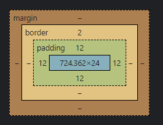

# CSS
만들어진 구조에 원하는 레이아웃을 적용하는 것

# 

## 기본 형태
```css
선택자 {
    속성 : 값;
    속성 : 값;
    ...
}
```

### 선택자(Selector)
- 작성한 HTML에 CSS 스타일을 적용하기 위해 HTML의 특정 요소를 선택하는 Sign (어디에 적용할지 선택, 특정 태그, id, class)
```css
TAG {
    Properties : Value
}

.Class{
    Properties : Value
}
```

### 속성(Properties), 값(Value)
- 선택자에 적용 가능한 스타일(속성)을 특정 값으로 지정
- HTML의 속성은 Attribute, CSS의 속성은 Properties
- 속성에 따라 여러 값이 들어갈 수 있음
    - 단축속성 & 개별속성
        - ex
            - margin : 단축속성
            - margin-top, margin-left, margin-right, margin-bottom : 개별속성

[CSS mdn](https://developer.mozilla.org/ko/docs/Web/CSS "CSS mdn")

# 

# 선언 방식

### 태그에 직접 작성(인라인)하는 선언방식

\<<span style="color:blue">TAG</span> <span style="color:skyblue">style=</span><span style="color:orange">"속성: 값;"</span>>contents\<<span style="color:blue">/TAG</span>>
- 선택자 필요 없이 직접 선언 가능
- 반복된 요소에 적용할 때 인라인 선언 방식을 지양해야한다.
- JavaScript로 HTML에 CSS를 강제로 삽입할 때는 상관X

### HTML에 내장하여 표현
```html
<head>
    <style>
        TAG {
            Properties : Value;
        }
    </style>
</head>
```

- style태그를 통해 CSS코드가 HTML안에 포함되어있는 상황

### HTML 외부에서 불러오기(link)
```html
<head>
    <link rel="stylesheet" href="경로">
</head>
```
- 외부 .css 파일을 link태그로 절대/상대 경로를 통해 불러와 적용시키는 것

### @import 방식
@import를 이용하여 외부로부터 문서를 불러오는 방식
- css가 css를 가져오는 방식
- link로 여러 css를 불러오는 경우 병렬 호출로 불러오지만 @import로 불러오는 css는 직렬 호출로 불러오므로 시간이 더 걸릴 수 있다.
- 특정 css가 모두 호출 된 후 사용되어야하는 특별한 경우 @import로 호출 해야할 것.
```html
<!-- index.html -->
<head>
    <link rel="stylesheet" href = "./css/style1.css">
</head>
<body>
    <div>sample</div>
</body>
```
```css
/* style1.css */
@import url("./style2.css")
```
```css 
/* style2.css */
div {
    color: red;
    background-color: blue;
}
```

CSS 작성 시 HTML 구조의 순서와 동일하게 작성하는 것이 유지보수에 유리

#

# 선택자

## 기본 선택자(Basic Selectors)
- 전체 선택자(Universal Selector)
    - 요소 내부의 모든 요소를 선택
    - [Universal Selector mdn](https://developer.mozilla.org/ko/docs/Web/CSS/Universal_selectors "Universal Selector mdn")
```css
    * { };
```

- 태그 선택자(Type Selector)
    - 특정 태그 이름인 요소를 선택
    - [Type Selector mdn](https://developer.mozilla.org/ko/docs/Web/CSS/Type_selectors "Type Selector mdn")
```css
    Tag {};
```

- 클래스 선택자(Class Selector)
    - HTML class 속성의 값을 요소로 선택
    - [Class Selctor mdn](https://developer.mozilla.org/ko/docs/Web/CSS/Class_selectors "Class Selector mdn")
```css
    .class {};
```

- 아이디 선택자(ID Selector)
    - HTML id 속성의 값을 요소로 선택
    - HTML에서 id는 고유해야함.
    - [ID Selector mdn](https://developer.mozilla.org/ko/docs/Web/CSS/ID_selectors "ID Selector mdn")
```css
    #id {};
```

## 복합 선택자(Combinators)
기본 선택자들을 조합해서 사용
- 일치 선택자(Basic Combinator)
    - 붙여서 표현한 기본 선택자들의 조건이 모두 만족하는 경우 스타일 적용
```css
    tag.class#id {};
```
- 자식 선택자(Child Combinator)
    - 기본 선택자 Parent의 자식 기본 선택자 Child를 선택
    - 한 depth 차이인 경우 부모/자식 관계
    - [Child Combinator mdn](https://developer.mozilla.org/ko/docs/Web/CSS/Child_combinator "Child Combinator mdn")
```css
    Parent > Child {};      /* 조건 > 조건 > .. > 선택*/
```
- 후손(하위) 선택자(Descendant Combinator)
    - 기본 선택자 조상(상위) 요소의 후손(하위) 요소인 기본 선택자를 선택
    - depth 차이가 나도 조상(상위) 요소 내부에 포함되어 있다면 모두 후손(하위) 요소로 판단 가능
    - 띄어쓰기로 선택자 구분
    - [Descendant Combinator mdn](https://developer.mozilla.org/ko/docs/Web/CSS/Descendant_combinator "Descendant Combinator mdn")
```css
    Parent Child {};
```
- 인접 형제 선택자(Adjacent Sibling Combinator)
    - 같은 부모 요소를 공유하는 다른 요소(형제) 선택
    - 특정 요소의 바로 다음 지정 형제 요소 하나만을 선택
    - [Adjacent Sibling Combinator mdn](https://developer.mozilla.org/ko/docs/Web/CSS/Adjacent_sibling_combinator "Adjacent Sibling Combinator mdn")
```css
    A + B {};
```
```html
<P>
    <A></A>
    <B></B>     <!-- A의 다음 형제요소 B 하나만을 선택 -->
    <B></B>
</P>
```

- 일반 형제 선택자(General Sibling Combinator)
    - 같은 부모 요소를 공유하는 다른 요소(형제) 선택
    - 특정 요소의 인접한 다음 형제 요소 모두 선택
    - [General Sibling Combinator](https://developer.mozilla.org/ko/docs/Web/CSS/General_sibling_combinator "General Sibling Combinator mdn")
```css
    A ~ B {};
```
```html
<P>
    <B></B>     <!-- 이전 형제 요소는 선택X-->
    <A></A>
    <B></B>     <!-- 다음 B 모두 선택-->
    <B></B>     <!-- 다음 B 모두 선택-->
</P>
```

## 가상 클래스 선택자(Pseudo-Classes Selectors)
기본 선택자를 활용(:)

### :hover
기본 선택자에 마우스 포인터가 올라가 있는 동안에만 선택
- [:hover mdn](https://developer.mozilla.org/ko/docs/Web/CSS/:hover ":hover mdn")
```css
    E:hover {};
```

### :active
기본 선택자를 마우스로 클릭하고 있는 동안에만 선택
- [:active mdn](https://developer.mozilla.org/ko/docs/Web/CSS/:active ":active mdn")
```css
    E:active {};
```

### :focus
[대화형 콘텐츠](https://developer.mozilla.org/ko/docs/Web/Guide/HTML/Content_categories#%EB%8C%80%ED%99%94%ED%98%95_%EC%BD%98%ED%85%90%EC%B8%A0 "대화형 콘텐츠") 선택자가 포커스 된 동안에만 선택
- [:focus mdn](https://developer.mozilla.org/ko/docs/Web/CSS/:focus ":focus mdn")
```css
    E:focus {};
```

### :first-child
해당 기본 선택자의 형제 요소들 중 첫 번째 요소만 선택
- [:first-child mdn](https://developer.mozilla.org/ko/docs/Web/CSS/:first-child ":first-child mdn")
```css
    E:first-child {};
```

### :last-child
해당 기본 선택자의 형제 요소들 중 마지막 요소만 선택
- [:last-child mdn](https://developer.mozilla.org/en-US/docs/Web/CSS/:last-child ":last-child mdn")
```css
    E:last-child {};
```

### :nth-child
해당 기본 선택자의 형제 요소들 중 n 번째 요소만 선택
- n에 해당하는 값이 (xn)일 때 x의 배수마다 선택
- n에 해당하는 값이 (n + x)일 때 x번째 요소부터 끝까지 선택
- [:nth-child mdn](https://developer.mozilla.org/ko/docs/Web/CSS/:nth-child ":nth-child mdn")
```css
    E:nth-child(n) {};
```

### :nth-of-type(n)
해당 기본 선택자의 타입(태그의 이름)과 동일한 타입인 형제 요소 중 해당 기본 선택자가 n번째 요소라면 선택
- 특정 선택자의 타입 중 n번째 선택
- 태그를 찾는 개념으로서만 사용할 것
- [:nth-of-type() mdn](https://developer.mozilla.org/en-US/docs/Web/CSS/:nth-of-type ":nth-of-type() mdn")
```css
    E:nth-of-type(n) {};
```

### 부정 선택자(Negation Selector)
S가 아닌 요소 선택
- :not()
- [:not() mdn](https://developer.mozilla.org/ko/docs/Web/CSS/:not ":not() mdn")
```css
    E:not(S) {};
```
#### 가상클래스의 경우 역순으로 해석하는 것이 보다 정확함.
#### 콜론(:)앞에 특정 요소를 작성하지 않을 경우 특정 요소가 아닌 가능한 경우들이 모두 선택될 수 있다.

#

# 가상 요소 선택자(Pseudo-Elements Selectors)
콜론 두개(::)로 표현
- content 속성을 사용해야 가상 요소 선택자를 사용할 수 있다.

### ::before
특정 요소 내부에서 내용의 앞에 내용(content)을 삽입
- [::before mdn](https://developer.mozilla.org/ko/docs/Web/CSS/::before "::before mdn")
```css
    E::before {};
```

### ::after
특정 요소 내부에서 내용의 뒤에 내용(content)을 삽입
- [::after mdn](https://developer.mozilla.org/ko/docs/Web/CSS/::after "::after mdn")
```css
    E:after {};
```

#

# 속성 선택자(Attribute Selectors)
HTML의 속성을 포함한 요소 선택
- \[attribute]
    - 특정 속성을 포함한 요소 모두 선택
```css
    [attribute] {};
```

- \[attribute=value]
    - 특정 속성을 포함하여 값이 value인 요소 선택
```css
    [attribute=value] {};
```

- \[attribute^=value]
    - 특정 속성을 포함하여 값이 value로 시작하는 요소 선택
```css
    [attribute^=value] {};
```

- \[attribute$=value]
    - 특정 속성을 포함하여 값이 value로 끝나는 요소 선택
```css
    [attribute$=value] {};
```

- [Attribute Selectors mdn](https://developer.mozilla.org/ko/docs/Web/CSS/Attribute_selectors "Attribute Selectors mdn")


#

# 상속(Inheritance)
CSS의 일부 속성은 상속되는 속성(Inherited properties)으로 하위 요소에도 모두 적용되는 경우가 존재
- 대부분 글자를 다루는 속성들이 상속됨.
- 원래는 상속되지 않는 속성들을 강제적으로 상속시킬 수 있음
    - 부모 요소의 속성의 값이 무엇이 되던지 간에 해당 값을 강제로 상속 받아 사용할 수 있다.
```html
<div class="parent">
    <div class="child"></div>
</div>
```
```css
.parent {
    position: absolute;     /* 상속되지 않는 속성과 값 */
}
.child {
    position: inherit;      /* 강제 상속 받아 position: absolute; 와 동일*/
}
```
- [Inheritance mdn](https://developer.mozilla.org/ko/docs/Web/CSS/inheritance "Inheritance mdn")

#

# 우선 순위
같은 요소가 여러 선언의 대상이 될 경우 어떤 선언의 css 속성을 우선 적용할지 결정하는 방법
1. [명시도](https://developer.mozilla.org/ko/docs/Web/CSS/Specificity "명시도 mdn") : 명시도 점수가 높은 선언이 우선
2. 선언 순서 : 점수가 같은 경우, 가장 마지막에 해석(늦게 작성 된)되는 선언이 우선
3. 중요도 : 명시도는 '상속' 규칙보다 우선, !important가 적용된 선언 방식이 다른 모든 방식보다 우선
```html
<body>
    <div id="color_yellow" class="color-green" style="color: orange;">Hello world!</div>
                                    <!-- 인라인 선언방식 -->
</body>
```
```css
div { color: red !important; }      /* !important */
#color_yellow { color: yellow; }    /* 아이디 선택자 */
.color-green { color: green;}       /* 클래스 선택자 */
div { color: blue; }                /* 태그 선택자 */
* { color: darkblue; }              /* 전체 선택자 */
body { color: violet; }             /* 상속 */
```
## 명시도 점수
1. !important           (∞ pt)
2. 인라인 선언 방식     (1000 pt)
3. 아이디 선택자        (100 pt)
4. 클래스 선택자        (10 pt)
5. 태그 선택자          (1 pt)
6. 전체 선택자          (0 pt)
7. 상속                 (계산하지 않음)

```css
.list li.item { color: red; }  /* 21pt */
.list li:hover { color: red; }  /* 21pt */
.box::before { content: "Good "; color: red; }  /* 11pt */
#submit span { color: red; }  /* 101pt */
header .menu li:nth-child(2) { color: red; }  /* 22pt */
h1 { color: red; }  /* 1pt */
:not(.box) { color: red; }  /* 10pt */
:not(span) { color: red; }  /* 1pt */

/* 가상 요소는 태그 선택자와 같이 1pt (요소 = 태그) */
/* 부정 선택자인 가상 클래스 :not()은 점수를 가지지 않는다. */
```

#

## Reset.css 라이브러리
브라우저마다 초기 설정된 기본값들이 다르기 때문에 CSS 스타일을 reset 후 문서를 작성해야 함.
[reset.css cdn](https://www.jsdelivr.com/package/npm/reset-css "reset.css cdn")

#

## Emmet
Emmet 문법을 사용해 편리한 문서작성 가능
[Emmet cheet-sheet](https://docs.emmet.io/cheat-sheet/ "Emmet cheet-sheet")

#

# CSS 단위

### px
지정한 크기만큼 사이즈 고정

### %
부모 요소에 영향을 받아서 단위가 완성

### em
자기 자신이 가지고 있는 폰트 크기에 영향을 받음
- font-size * em 값으로 지정
- font-size에 em단위를 지정할 경우 기본 값인 10px에 em값을 곱한 크기로 지정

### rem
폰트 관련 속성은 기본적으로 상속되는데 rem단위로 작성하면 가장 높은 조상인 html에 작성된 폰트 사이즈만을 기준으로 크기를 지정
- 폰트 사이즈의 기본 값을 body에 작성해 놓으면 해당 문서의 기본값과 rem에서 사용하는 폰트 사이즈와 구분지어서 사용할 수 있다.

### vw
viewport-width, 보여지는 화면의 가로 너비 기준
- 백분율로 적용
- 반응형으로 작동

### vh
viewport-width, 보여지는 화면의 세로 너비 기준
- 백분율로 적용
- 반응형으로 작동

### vmax
viewport-max, 보여지는 화면에서 가로와 세로를 비교했을 때 현재 더 넓은 사이즈를 기준
- 백분율로 적용
- 반응형으로 작동

### vmin
viewport-min, 보여지는 화면에서 가로와 세로를 비교했을 때 현재 더 짧은 사이즈를 기준
- 백분율로 적용
- 반응형으로 작동

#

# 박스 모델

### width, height
요소의  가로 너비(width), 세로 너비(height)를 지정
- 기본값 : auto
    - auto
        - block 요소
            - width : 100%, height : 0
        - inline 요소
            - width : 0, height : 0
            - inline 요소는 기본적으로 가로 세로 값을 가질 수 없다.
- [width](https://developer.mozilla.org/ko/docs/Web/CSS/width "width mdn") / [height](https://developer.mozilla.org/ko/docs/Web/CSS/height "height mdn")

#

### max-width, min-width, max-heigth, min-height
요소의 최대(max), 최소(min) 가로 너비(width), 세로 너비(height)를 지정
- 부모 요소의 너비를 상속받아 가변하되, 최대, 최소 너비를 지정하는 방식
- max-width, max-height
    - 기본값 : none
    - auto : 브라우저가 너비를 계산
- min-width, min-heigjht
    - 기본값 : 0
    - auto : 브라우저가 너비를 계산
- [max-width](https://developer.mozilla.org/ko/docs/Web/CSS/max-width "max-width mdn") / [min-width](https://developer.mozilla.org/ko/docs/Web/CSS/min-width "min-width mdn") / [max-height](https://developer.mozilla.org/ko/docs/Web/CSS/max-height "max-height mdn") / [min-height](https://developer.mozilla.org/ko/docs/Web/CSS/max-height "min-height mdn") mdn

#

### margin
요소의 '외부(바깥)여백'을 지정
- 음수 값 사용 가능
- margin은 부모 요소의 width를 기준으로 지정 됨.
- 기본값 : 0
- 단축 속성
    - margin : 위 우 아래 좌;
    - margin : 위 [좌, 우] 아래;
    - margin : [위, 아래] [좌, 우];
    - margin : [위, 아래, 좌, 우];
- 개별 속성
    - margin-top, margin-right, margin-left, margin-bottom
- 마진 중복(병합, Collapse)
    - 마진의 특정 값들이 '중복'되어 합쳐지는 현상
        1. 형제 요소들의 margin-top 과 margin-bottom 이 만났을 때
        2. 부모 요소의 margin-top 과 자식 요소의 margin-top 이 만났을 때
            - 자식 요소의 margin-top 이 부모 요소에도 적용 된다.
        3. 부모 요소의 margin-bottom 과 자식 요소의 margin-bottom 이 만났을 때
            - 자식 요소의 margin-bottom 이 부모 요소에도 적용 된다.
    - 마진 중복 현상 발생시 중복 값을 계산하는 방법
        - 둘 다 양수 : 더 큰 값으로 중복
        - 둘 다 음수 : 더 작은 값으로 중복
        - 양수와 음수 : a + b
    - 마진 중복은 오류가 아닌 현상이므로 이를 응용해서 사용하거나 우회해서 해결할 수 있다.
- [margin mdn](https://developer.mozilla.org/ko/docs/Web/CSS/margin "margin mdn")

#

### padding
요소의 '내부(안) 여백'을 지정
- 기본값 : 0
- 단축 속성
    - padding : 위 우 아래 좌;
    - padding : 위 [좌, 우] 아래;
    - padding : [위, 아래] [좌, 우];
    - padding : [위, 아래, 좌, 우];
- 개별 속성
    - padding-top, padding-right, padding-left, padding-bottom
- 크기 증가
    - 추가된 padding 값 만큼 요소의 크기가 커지는 현상
    - padding 값 만큼 크기가 증가하므로 크기가 커지지 않도록 계산해야 한다.
        - 직접 계산
        - box-sizing: border-box; : 자동 계산
- [padding mdn](https://developer.mozilla.org/ko/docs/Web/CSS/padding "padding mdn")

#

### border
요소의 '테두리 선'을 지정
- 단축 속성
    - border : border-width border-style border-color
- 개별 속성
    - border-width : 선의 두께(너비) / 기본값 : medium
        - medium, thin, thick, 단위 지정
    - border-style : 선의 종류 / 기본값 : none
        - none, hidden, solid, dotted, dashed ....
        - [선의 종류](https://developer.mozilla.org/ko/docs/Web/CSS/border-style#%EA%B0%92 "선의 종류")
    - border-style : 선의 색상 / 기본값 : black
    - border의 각각의 개별 속성들은 개별속성이면서 추가적으로 단축 속성들이다.
- 요소의 외부에 선을 추가하는 것이므로 결과적으로 요소의 선만큼 크기가 추가된다고 볼 수 있다.
- [border mdn](https://developer.mozilla.org/ko/docs/Web/CSS/border "border mdn")

### border-width
요소의 '선의 두께'를 지정
- 기본값 : medium
- 단축 속성
    - border-width : 위 우 아래 좌;
    - border-width : 위 [좌, 우] 아래;
    - border-width : [위, 아래] [좌, 우];
    - border-width : [위, 아래, 좌, 우];
- 개별 속성
    - border-top-width, border-right-width, border-left-width, border-bottom-width
- [border-width mdn](https://developer.mozilla.org/ko/docs/Web/CSS/border-width "border-width mdn")

### border-style
요소의 '선의 종류'를 지정
- 기본값 : none
- 단축 속성
    - border-style : 위 우 아래 좌;
    - border-style : 위 [좌, 우] 아래;
    - border-style : [위, 아래] [좌, 우];
    - border-style : [위, 아래, 좌, 우];
- 개별 속성
    - border-top-style, border-right-style, border-left-style, border-bottom-style
- [border-style mdn](https://developer.mozilla.org/ko/docs/Web/CSS/border-style "border-style mdn")
- [선의 종류](https://developer.mozilla.org/ko/docs/Web/CSS/border-style#%EA%B0%92 "선의 종류")

### border-color
요소의 '선의 색상'을 지정
- 기본값 : black
- transparent : 투명한 선, 배경색이 지정되어 있다면 배경색이 보이게 된다.
- 단축 속성
    - border-color : 위 우 아래 좌;
    - border-color : 위 [좌, 우] 아래;
    - border-color : [위, 아래] [좌, 우];
    - border-color : [위, 아래, 좌, 우];
- 개별 속성
    - border-top-color, border-right-color, border-left-color, border-bottom-color
- [border-color](https://developer.mozilla.org/ko/docs/Web/CSS/border-color "border-color mdn")

#

### box-sizing
요소의 크기 계산 기준을 지정
- 기본값 : content-box
    - content-box : 너비(width, height)만으로 요소의 크기를 계산
    - border-box : 너비(width, height)에 안쪽 여백(padding)과 테두리 선(border)을 포함하여 요소의 크기를 계산
- content-box < padding-box < border-box < margin-box
    - 
- [box-sizing mdn](https://developer.mozilla.org/ko/docs/Web/CSS/box-sizing "box-sizing mdn")

#

### display
요소의 박스 타입(유형)을 설정
- block
- inline
- inline-block
    - 기본 특성은 inline이지만 widht, height 지정 가능 / margin, padding의 top, bottom 사용 가능
- 기타 (table, table-cell, flex ...)
- none
- [display mdn](https://developer.mozilla.org/ko/docs/Web/CSS/display "display mdn")