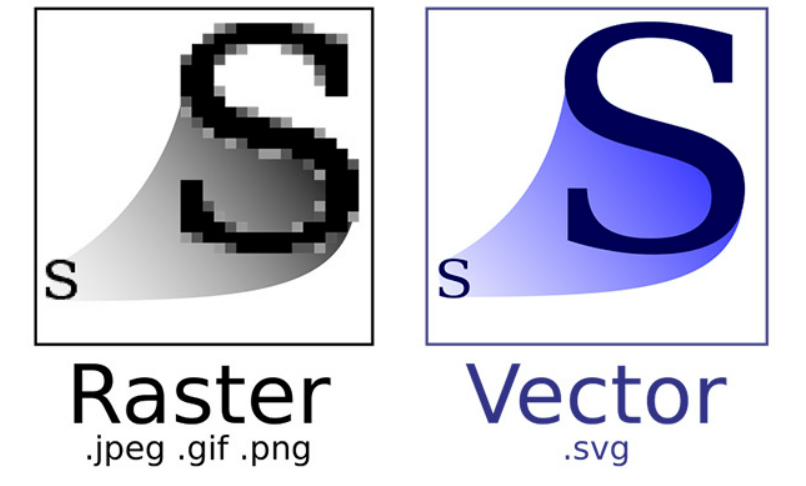

Study Start

HTML : 웹에서 자유롭게 오갈 수 있는 웹 문서를 만드는 언어
H : Hyer
T : Text
M : Mark up
L : Language

Hyper Text : 웹에서 자유롭게 오갈 수 있는 링크
Mark up : 꼬리표, 문서 안에서 사용되는 태그들로 구분하는 꼬리표를 붙여주는 행위

## HTML, CSS, JavaScript

#### 웹 표준
 - W3C의 권고안에 따라 웹에 사용되는 표준 기술이나 규칙

#### 크로스 브라우징
 - 구글 크롬, 사파리, 파이어폭스와 같은 다양한 웹 브라우저에서 동일한 사용자가 동일한 경험을 줄 수 있도록 제작하는 기술, 방법

#### 웹 접근성
 - 웹 콘텐츠를 사용하는 일반적인 사용자부터 특정 조건에 따른 제한이 있는 사용자까지 모두가 동등하게 웹에 접근하도록 웹 콘텐츠를 제작하는 방법
    - 정보통신기기
    - 웹 접근성 품질인증 마크

#### 웹 이미지

- 비트맵
  - 픽셀단위로 모여 만들어진 정보의 집합
  - 정교하고 다양한 색상을 자연스럽게 표현
  - 확대/축소 시 계단 현상, 품질 저하
  - .jpeg .png .gif .webp
    - jpg
      - 손실압축
      - 표현 색상도가 24비트라 고해상도 표시장치에 적합
      - 이미지의 품질과 용량을 쉽게 조절 가능
      - 높은 압축률 때문에 가장 대중적
    - png
      - 비손실 압축
      - 8~24비트로 컬러이미지 처리
      - Alpha Channel 지원(투명도 조절 가능)
      - W3C 권장 포멧
    - gif
      - 비손실 압축
      - 여러 이미지를 한 개의 이미지 파일에 담을 수 있음
      - 8비트 컬러만 지원
    - webp
      - jpg, png, gif를 모두 대체 가능한 이미지 포멧
      - 지원 브라우저의 제약이 있음
      - [upport browser for webp](https://caniuse.com/webp "지원 가능 브라우저")
- 벡터
  - 이미지가 가지고 있는 점, 선, 면의 위치등을 수학적 정보로 표현
  - 확대/축소 시 이미지가 깨지지 않고 용량변화가 없음
  - 인물이나 풍경사진과 같은 정교한 이미지를 표현하기 어려움
  - .svg
    - svg
      - 해상도의 영향을 받지 ㅇ닪음
      - CSS로 Styling 가능
      - JavaScript로 Event Handling 가능
      - 보통 일러스트로 이미지 작업

