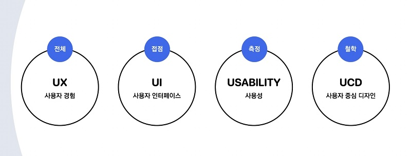
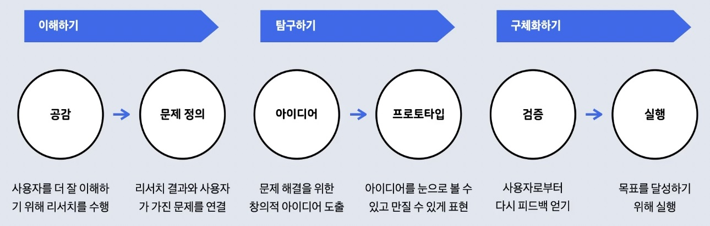
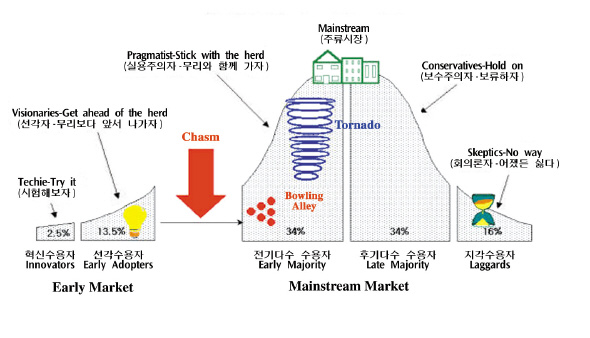

# Designable Developer

### UX
> User Experience, *사용자 경험  
> 시스템, 제품, 서비스를 사용하거나 사용을 예상하면서 도출된 사용자의 인식과 반응
> - UX는 UI, Usability, UCD 전체를 아우르는 **사용자 경험**
---

### UI
> User Interface, *사용자 인터페이스  
> 사용자가 대화형 시스템으로 특정 작업을 수행할 수 있도록 정보와 제어 수단을 제공하는 대화형 시스템(소프트웨어 또는 하드웨어)의 모든 구성 요소  
> - 사용자와 어떤 제품이나 서비스와 만나는 **접점**이자 공간  
> - UI(User Interface) : 스크린 기반 인터페이스  
> - PUI(Physical User Interface) : 물리적 제품 기반 인터페이스
---

### Usabilty
> *사용성  
> 특정 사용자가, 특정 사용 맥락에서 시스템, 제품, 서비스등을 사용할 때 효과, 효율성 만족도를 같은 특정 목표를 달성할 수 있는 정도나 범위
> - 사용자가 시스템, 제품, 서비스를 만났을 때 사용성을 좋다, 나쁘다 **측정**
---

### UCD
> User Centered Design, *사용자 중심 디자인  
> 사용자가 원하고 필요로 하는 것에 대해 사용자의 한계 능력과 상황에 맞추어 디자인 프로세스를 통해 사용자를 중심으로 사고하여 만들어 내는 인터페이스, 서비스, 제품 디자인의 철학적 접근 방법이자 디자인 사상
> - UX, UI, 사용성이 있어서 사용자를 중심으로 해야한다는 **철학**
---

##  디자인 씽킹(Design Thinking)
비즈니스 전략에 대한 요구를 충족시키기 위해 디자이너의 감수성과 작업방식을 이용하는 사고 방식 

> 이해하기
> - 공감 :사용자를 더 잘 이해하기 위해 리서치를 수행
> - 문제정의 : 리서치 결과와 사용자가 가진 문제를 연결

> 탐구하기
> - 아이디어 : 문제 해결을 위한 창의적 아이디어 도출
> - 프로토타입 : 아이디어를 눈으로 볼 수 있고 만질 수 있게 표현

> 구체화하기
> - 검증 : 사용자로붙어 다시 피드백 얻기
> - 실행 : 목표를 달성하기 위해 실행

### 비즈니스 모델(Business Model)
기업 업부, 제품 및 서비스의 전달 방법, **이윤을 창출하는 방법**을 나타낸 모형
- 비즈니스를 이해해야 디자인을 통해 이익을 창출해낼 수 있으므로 비즈니스 분석을 통해 비즈니스 이해를 위한 모델을 만들어낼 수 있어야한다.
  - EX) [Lean Canvas](https://leanstack.com/lean-canvas)

### 비즈니스를 위한 데이터
제품이 나오기 전에 데이터를 수집해 볼 수 있는 방법
- [Naver DataLab](https://datalab.naver.com/), [Google Trends](
https://trends.google.co.kr ), [Sometrend](https://some.co.kr/), [Keyword Tool](https://keywordtool.io/), [Statcounter](https://gs.statcounter.com
)

### 비즈니스 목적에 따른 UX
> 컨텐츠
> - 사용자에게 다양한 형태의 콘텐츠와 관련 정보를 제공
> - 사용자의 멘탈모델에 맞는 카테고리와 효과적인 검색 도구 설계가 중요

> 태스크
> - 사용자의 중요한 업무를 처리하는 것을 목적으로 함
> - 다른 곳에서 할 수 없는 기능을 제공해야하며 초보 사용자와 숙련 사용자를 모두 고려해야 함

> 마케팅
> - 일정 기간 동안 특정 사용자들로부터 설문에 대한 답변이나 통계학적 데이터를 얻는 것을 목적으로 함
> - 사용자에게 명확하고 즉각적인 가치를 제안하여 흥미와 재미를 유발하고 특정한 행동을 유도해야함

> 브랜딩
> - 회사와 이 회사의 제품에 관심을 가진 사용자 간의 긍정적인 관계를 촉진시키는 것을 목적으로 함
> - 현재 사용자와 잠재 사용자는 물론 투자자, 사업 파트너, 미디어, 구직자까지 고려해야 함

> 커머스
> - 컨텐츠, 태스크, 마케팅, 브랜딩 목적의 UX 특성을 모두 포함
> - 제품의 특성을 명료하게 설명해야하고 유용한 콘텐츠와 편리한 기능 제공 필요

> 온디맨드
> - 태스크, 마케팅, 브랜딩 제품 유형의 특성을 포함
> - 초보 사용자와 숙련 사용자를 고려해야하며 빠르게 원하는 태스크를 수행가능해야 함

> 소셜
> - 태스크 중심의 제품 특성을 포함
> - 즐거운 기능을 제공하는 동시에 강력한 보안 기능을 제공해야 함.

### 초기 사용자(Early Market)
혁신 수용자 + 선각 수용자

#### 기술수용주기

> 혁신 수용자 (Innovatiors) - 2.5%
> - 첨단 기술에 대한 이해가 빠르며 분석하기를 좋아함
> - 제품의 실제 효용보다는 기술 자체에 대한 관심이 높아 아직 검증되지 않은 신제품을 적극적으로 구매
> - 새로운 제품에 열정적으로 반응하지만 좀처럼 입소문을 내지 않는 집단

> 선각 수용자 (Early Adopters) - 13.5%
> - 혁신 수용자와 마찬가지로 분석하기를 좋아함
> - 제품을 구매할 때 주변의 평가에 의존하기보다는 자신의 직관과 분석에 의존
> - 혁신수용자와 달리 입소문 내기를 좋아함

> 전기 다수 사용자 (Early majority) - 34%
> - 선각 수용자의 행동을 보고 첨단 기술이나 제품의 실용적인 활용방법을 모색하는 집단
> - 어느 정도 기술과 신제품에 대해 관심이 있지만, 혁신 수용자나 선각 수용자보다 실용성에 더 무게를 둠

> 후기 다수 사용자 (Late Majority) - 34%
> - 신제품이 시장의 표준으로 자리 잡을 때까지 기다린 후 제품을 구매하는 집단
> - 첨단기술을 소화하는데 있어 전기 다수 사용자들 만큼 자신의 능력을 확신하지 않음
> - 제품 구매 후에도 많은 지원을 기대해 AS가 확실한 큰 회사의 상품을 구매하는 경향이 있

> 지각 수용자(Laggards) - 16%
> - 개인적 성향 또는 경제적 이유로 좀처럼 신기술을 받아들이지 않는 사람들
> - 첨단 기술을 구매하는 경우가 있다 하더라도 제품의 기술성과 필요성은 모를 활률이 높음

> 캐즘(Chasm)
> - 지질학 용어로 지각변동으로 인해 골이 깊고 넓어지면서 지각이 단절된 것을 의미
> - 초기시장에서 주류시장으로 넘어가는 과도기에 일시적으로 수요가 정체되거나 후퇴하는 단절현상을 의미
> - 빠르게 가설을 잡고, 테스트, 검증을 통해 사용자로부터 배워 캐즘을 극복해야함

#### 참고자료
Feedly, 
